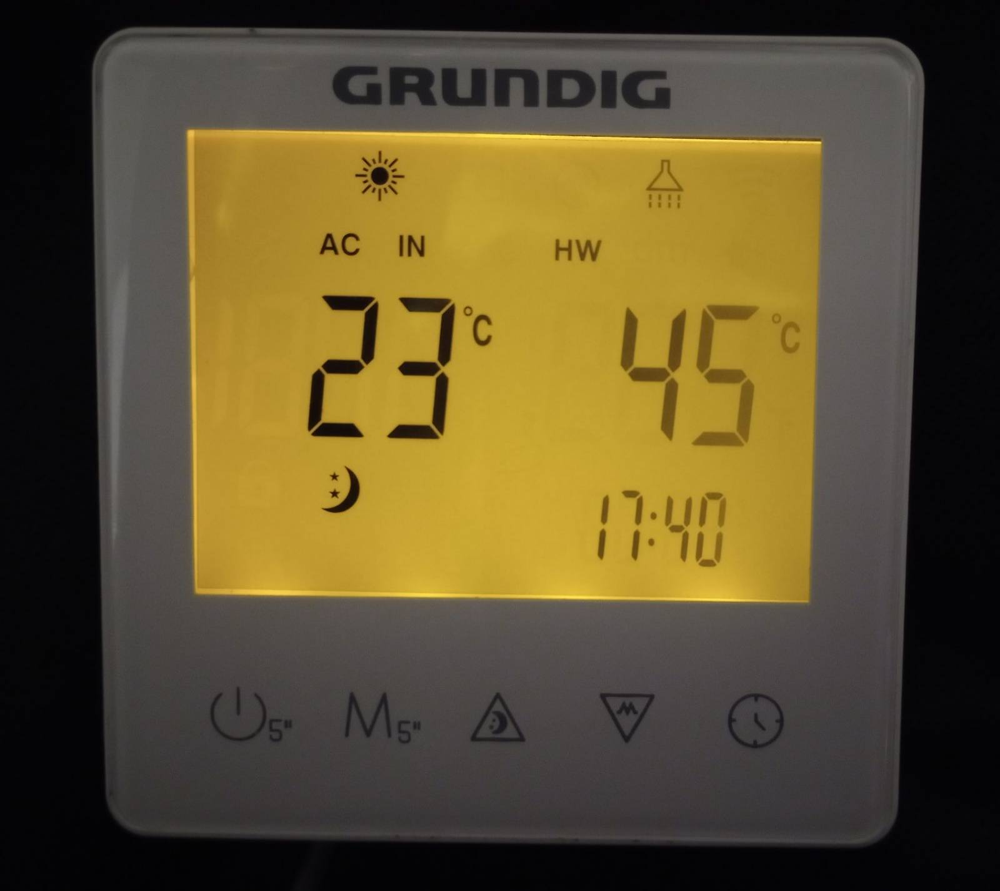
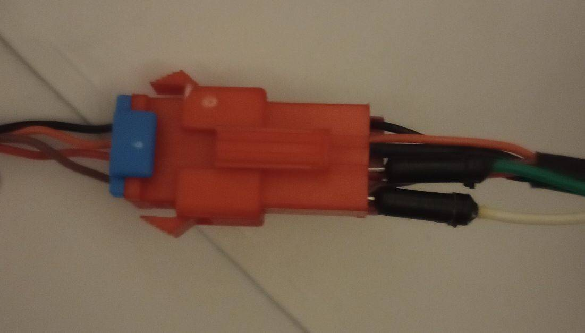
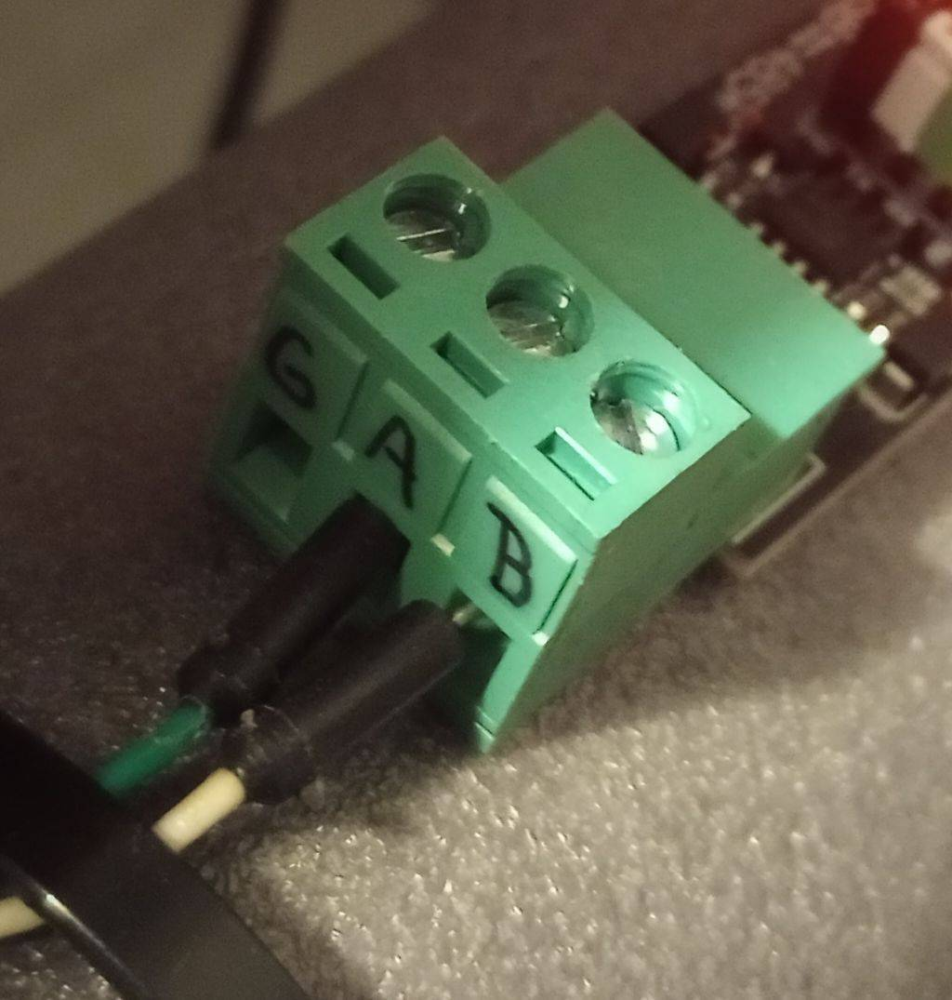

Since there is no (yet) working modbus connection to Grundig GHP-MM heat pumps with GR-LC07 controller, the only way to get/set data is to tap  modbus communication between controller & unit

ghp-mm2mqtt.py is quick & dirty hack to publish eavesdropped communication between unit and controller to MQTT (to be consumed by ie HASS)

```
wget https://raw.githubusercontent.com/a1bert01/GHP-MM-sniffer/refs/heads/main/ghp-mm2mqtt.py
#edit to set serial port and mqtt credentials
chmod +x ./ghp-mm2mqtt.py
./ghp-mm2mqtt.py
```

connect your rs485 B to brown and A to red wire (black is GND, orange 12V):

 

